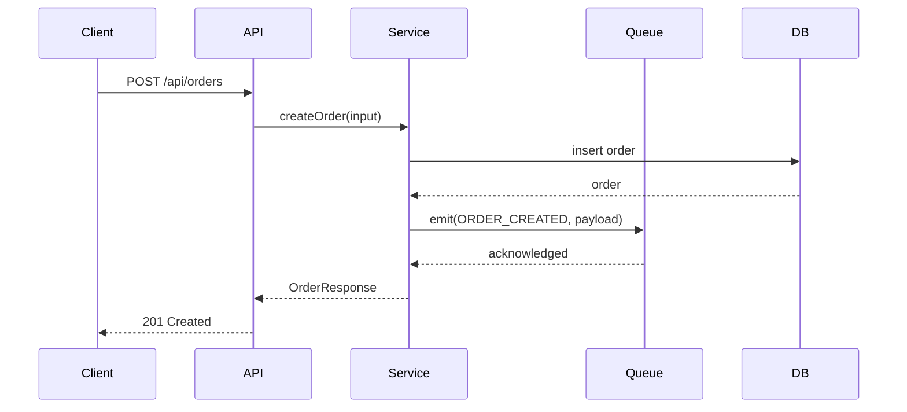

# Feature Guide Specification

## Purpose

Every feature in the codebase gets exactly one feature guide. This file contains
the mandatory section template, authoring rules, and a complete worked example.
Load it whenever writing or reviewing any feature guide file.

---

## Naming Convention

Feature guides follow the naming convention defined in your project's `CLAUDE.md`.

Suggested default:
```
FEAT-{kebab-case-feature-name}.md

Examples:
  FEAT-user-authentication.md
  FEAT-order-fulfillment.md
  FEAT-payment-processing.md
  FEAT-notification-dispatch.md
```

Location: defined per project (e.g., `docs/features/` or project root).

---

## Mandatory 6-Section Template

Every feature guide MUST contain all 6 sections in this order. No exceptions.
Missing sections fail Quality Gate G2.

---

### Section 1 — Business Use Case

**Length**: 2–4 sentences
**Content**: What problem does this feature solve? Who uses it? Why does it exist?
**Tone**: Non-technical first sentence, then technical context.

```markdown
## Business Use Case

[Feature name] enables [who] to [what outcome] without [previous friction/manual step].
It exists because [business/regulatory/UX driver]. In this system, it is triggered
by [entry point] and produces [key output].
```

---

### Section 2 — Flow Diagram

**Format**: Mermaid `sequenceDiagram`
**Rule**: Diagram must reflect actual code flow — verify against source files before finalizing.
**Participants**: Use the actual layers of your system (e.g., `Client`, `API`, `Service`, `DB`).
Add `Queue`, `Cache`, `ExternalAPI`, `Worker` only if genuinely present in the flow.

```markdown
## Flow Diagram

\`\`\`mermaid
sequenceDiagram
    participant Client
    participant API
    participant Service
    participant DB

    Client->>API: POST /api/{resource}
    API->>Service: create{Resource}(input)
    Service->>DB: insert {resource}
    DB-->>Service: {resource}
    Service-->>API: {Resource}Response
    API-->>Client: 201 Created
\`\`\`
```

**Extended example with async processing:**


---

### Section 3 — Code Structure

**Format**: Markdown table
**Rule**: Every file path must be verified to exist in the codebase (Quality Gate G5).

```markdown
## Code Structure

| File | Responsibility |
|---|---|
| `src/{feature}/{feature}.controller.ts` | HTTP endpoint definitions, request validation |
| `src/{feature}/{feature}.service.ts` | Business logic |
| `src/{feature}/{feature}.repository.ts` | Database operations |
| `src/{feature}/dto/{feature}.dto.ts` | Request/response shape definitions |
```

> **Adapt to your project**: File paths and naming conventions should match your actual
> project structure. Verify all paths exist before documenting.

---

### Section 4 — Key Methods

**Format**: Markdown table
**Rule**: Method signatures must match the actual signatures in source files.
**Columns**: Method name, signature (language-appropriate), one-line description.

```markdown
## Key Methods

| Method | Signature | Description |
|---|---|---|
| `create{Resource}` | `(input: Create{Resource}Input) → {Resource}` | Creates resource and emits domain event |
| `find{Resource}ById` | `(id: string) → {Resource} | null` | Retrieves resource by ID |
| `update{Resource}` | `(id: string, input: Update{Resource}Input) → {Resource}` | Partial update with audit trail |
| `cancel{Resource}` | `(id: string, reason: string) → void` | Soft-cancels resource and triggers cleanup |
```

---

### Section 5 — Error Cases

**Format**: Markdown table
**Rule**: Every error/exception code MUST be verified in the project's error source
files before documenting (Quality Gate G3). HTTP Status must match the actual response.

> **Project configuration**: Confirm the error source file location from your project's
> `CLAUDE.md` before running Gate G3. Do not assume paths.

```markdown
## Error Cases

| Error Code | Condition | HTTP Status |
|---|---|---|
| `{RESOURCE}_NOT_FOUND` | Resource does not exist | 404 |
| `{RESOURCE}_ALREADY_EXISTS` | Duplicate creation attempt | 409 |
| `{RESOURCE}_INVALID_STATE` | State machine transition not allowed | 422 |
| `{RESOURCE}_CREATION_FAILED` | Write failed after retries | 500 |
```

**Inline documentation rule**: Error codes should also be documented inline in the error
source file with a comment referencing the feature guide (e.g., `# Used by: FEAT-{feature}.md`).

---

### Section 6 — Configuration

**Format**: Markdown table
**Rule**: Every config key/env var MUST be verified in the project's config source
before documenting (Quality Gate G4).

> **Project configuration**: Confirm the config source file location from your project's
> `CLAUDE.md` before running Gate G4. Do not assume paths.

```markdown
## Configuration

| Variable | Purpose | Default |
|---|---|---|
| `{FEATURE}_ENABLED` | Feature flag — disables all endpoints when false | `true` |
| `{FEATURE}_TIMEOUT_MS` | Max processing time before timeout error | `30000` |
| `{FEATURE}_RETRY_ATTEMPTS` | Write retry attempts on transient failure | `3` |
```

If the feature has no configuration variables, write:
```markdown
## Configuration

No feature-specific configuration. See project config source for global settings.
```

---

## Complete Worked Example — Order Fulfillment

```markdown
# FEAT-order-fulfillment.md

## Business Use Case

The Order Fulfillment feature manages the full lifecycle of a customer order from
placement through delivery or cancellation. It is used by customers placing orders
and by internal background jobs that expire stale orders after 48 hours. This feature
is the central state authority that all downstream features (inventory reservation,
payment capture, shipping notification) depend on for order state.

## Flow Diagram

\`\`\`mermaid
sequenceDiagram
    participant Client
    participant API
    participant Service
    participant DB
    participant Queue

    Client->>API: POST /api/orders
    API->>Service: createOrder(input)
    Service->>DB: insert order (status: PENDING)
    DB-->>Service: order
    Service->>Queue: emit(ORDER_CREATED, {id, customerId})
    Queue-->>Service: acknowledged
    Service-->>API: OrderResponse
    API-->>Client: 201 Created
\`\`\`

## Code Structure

| File | Responsibility |
|---|---|
| `src/orders/orders.controller.ts` | HTTP endpoints: create, update, cancel, archive |
| `src/orders/orders.service.ts` | State machine logic, event emission |
| `src/orders/orders.repository.ts` | All database queries for order entity |
| `src/orders/dto/create-order.dto.ts` | Inbound creation payload shape |
| `src/orders/dto/order-response.dto.ts` | Outbound response shape |

## Key Methods

| Method | Signature | Description |
|---|---|---|
| `createOrder` | `(input: CreateOrderInput) → OrderResponse` | Creates order record and emits ORDER_CREATED event |
| `cancelOrder` | `(id: string, reason: CancelReason) → void` | Soft-cancels and triggers inventory release |
| `findOrderById` | `(id: string, customerId: string) → Order | null` | Customer-scoped lookup, null if not found |
| `archiveOrder` | `(id: string) → void` | Generates invoice PDF and schedules purge |

## Error Cases

| Error Code | Condition | HTTP Status |
|---|---|---|
| `ORDER_NOT_FOUND` | Order ID does not exist for customer | 404 |
| `ORDER_INVALID_STATE_TRANSITION` | State machine rejects the requested transition | 422 |
| `ORDER_ALREADY_CANCELLED` | Cancellation attempted on already-cancelled order | 409 |
| `ORDER_FULFILLMENT_FAILED` | Downstream service failure after retries | 500 |

## Configuration

| Variable | Purpose | Default |
|---|---|---|
| `ORDER_AUTO_EXPIRE_HOURS` | Hours of inactivity before auto-expiration job fires | `48` |
| `ORDER_INVOICE_RETENTION_DAYS` | Days to retain archived invoices before purge | `2555` |
| `ORDER_RETRY_ATTEMPTS` | DB retry attempts on transient failure | `3` |
```

---

## Review Checklist

Use this when reviewing an existing feature guide:

- [ ] Section 1: Business use case present, 2–4 sentences, non-technical first sentence
- [ ] Section 2: Flow diagram present, participants match actual code layers
- [ ] Section 3: Code structure table present, all paths verified in codebase
- [ ] Section 4: Key methods table present, signatures match source code
- [ ] Section 5: Error codes table present, all codes verified in project error source
- [ ] Section 6: Config table present, all keys verified in project config source
- [ ] File named per project naming convention (e.g., `FEAT-{kebab-case}.md`)
- [ ] Referenced in parent CONTEXT.md routing table
